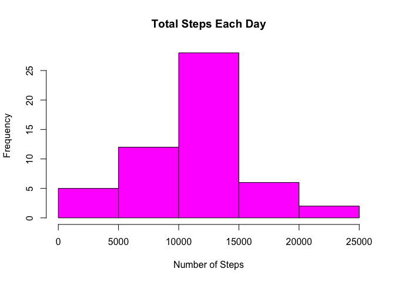
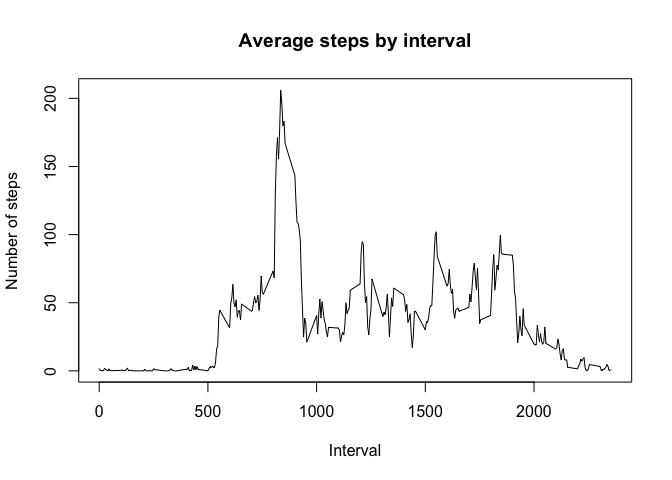
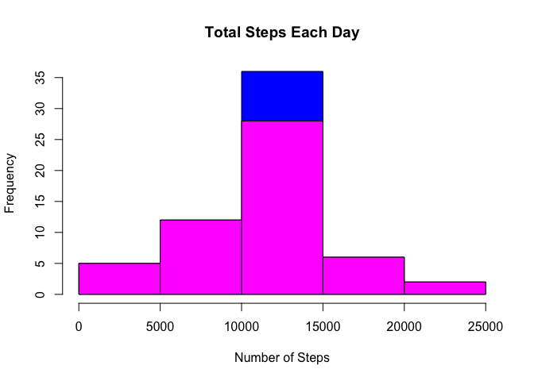
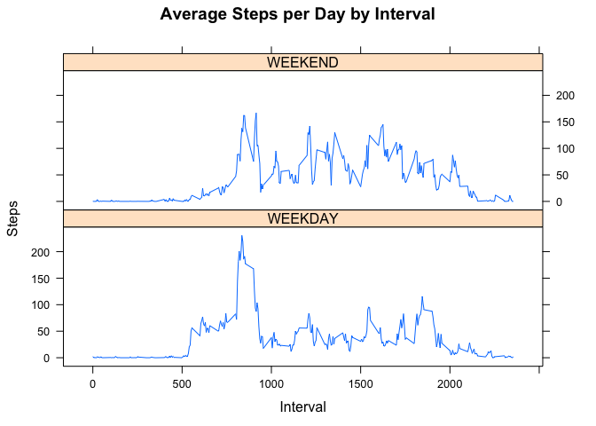

# Reproducible Research: Peer Assessment 1

## Loading and preprocessing the data

```r
mydata<-read.csv("activity.csv",header=TRUE,sep=",")
```

## What is mean total number of steps taken per day?
####1. Make a histogram of the total number of steps taken each day


```r
## library used
library(sqldf)
```

```
## Loading required package: gsubfn
## Loading required package: proto
## Loading required package: RSQLite
## Loading required package: DBI
```

```r
## sum total steps by date using sql
stepsbydate<-sqldf("select date,sum(steps) totsteps from mydata where steps is not NULL group by date")
```

```
## Loading required package: tcltk
```

```r
hist(stepsbydate$totsteps,main=paste("Total Steps Each Day"),col="magenta",xlab="Number of Steps")
```

 

####2. Calculate and report the mean and median total number of steps taken per day

```r
mean1<-mean(stepsbydate$totsteps)
median1<-median(stepsbydate$totsteps)
```
Mean is 1.0766189\times 10^{4} and Median is 10765

## What is the average daily activity pattern?
####1. Make a time series plot (i.e. type = "l") of the 5-minute interval (x-axis) and the average number of steps taken, averaged across all days (y-axis)

```r
averagebyinterval<-aggregate(steps ~ interval,mydata,mean)
plot(averagebyinterval,type="l",main="Average steps by interval",xlab="Interval",ylab="Number of steps")
```

 

####2. Which 5-minute interval, on average across all the days in the dataset, contains the maximum number of steps?

```r
myinterval<-averagebyinterval[which.max(averagebyinterval$steps),1]
print(myinterval)
```

```
## [1] 835
```
Maximum number of steps is in 5-minute interval = 835

## Imputing missing values
####Note that there are a number of days/intervals where there are missing values (coded as NA). The presence of missing days may introduce bias into some calculations or summaries of the data.
####1. Calculate and report the total number of missing values in the dataset(i.e. the total number of rows with NAs)

```r
sum(!complete.cases(mydata))
```

```
## [1] 2304
```

```r
## other options using sqldf library. NA is also a NULL
sqldf("select count(*) from mydata where steps IS NULL")
```

```
##   count(*)
## 1     2304
```
Total number of rows with NAs is 2304


####2. Devise a strategy for filling in all of the missing values in the dataset. The strategy does not need to be sophisticated. For example, you could use the mean/median for that day, or the mean for that 5-minute interval, etc.

```r
## getting mean by interval
meanbyinterval<-aggregate(steps ~ interval,mydata,mean)


mydata2<-mydata  ## store to mydata2 for working purpose

##building sql statement to update NA values with mean for that 5-minute interval
sqlupdate<-c("update mydata2 set steps = (select steps from meanbyinterval where interval=mydata2.interval) where steps IS NULL","select * from main.mydata2")
```

####3. Create a new dataset that is equal to the original dataset but with the missing data filled in.

```r
##run sqlupdate and store the result into mydata3
mydata3<-sqldf(sqlupdate)
```

####4. Make a histogram of the total number of steps taken each day and Calculate and report the mean and median total number of steps taken per day. 

```r
stepsbydate2<-sqldf("select date,sum(steps) totsteps from mydata3 group by date")
hist(stepsbydate2$totsteps,main=paste("Total Steps Each Day"),col="blue",xlab="Number of Steps")
```

 

```r
mean2<-mean(stepsbydate2$totsteps)
median2<-median(stepsbydate2$totsteps)
```
Mean is 1.0766189\times 10^{4} and Median is 1.0766189\times 10^{4}

####Do these values differ from the estimates from the first part of the assignment? 


```r
diffmean<-mean1-mean2
diffmedian<-median1-median2
```

- The difference between the non-imputed mean and imputed mean is 0
- The difference between the non-imputed median and imputed median -1.1886792 


```r
## after imputed
hist(stepsbydate2$totsteps,main=paste("Total Steps Each Day"),col="blue",xlab="Number of Steps")

## before imputed
hist(stepsbydate$totsteps,main=paste("Total Steps Each Day"),col="magenta",xlab="Number of Steps",add=T)
```

 

####What is the impact of imputing missing data on the estimates of the total daily number of steps?
Total daily number of steps has increased in range 10000 to 15000


## Are there differences in activity patterns between weekdays and weekends?

####For this part the weekdays() function may be of some help here. Use the dataset with the filled-in missing values for this part.

####1. Create a new factor variable in the dataset with two levels – “weekday” and “weekend” indicating whether a given date is a weekday or weekend day.

```r
## set what day is weekday
myweekdays<-c("Monday","Tuesday","Wednesday","Thursday","Friday")

## get day using weekdays() function
mydata3$day<-weekdays(as.Date(mydata3$date))

## if value is element of weekdays set as WEEKDAY, else set as WEEKEND. Change to factor variable
mydata3$day<-as.factor(ifelse(is.element(mydata3$day,myweekdays),"WEEKDAY","WEEKEND"))
```

####2. Make a panel plot containing a time series plot (i.e. type = "l") of the 5-minute interval (x-axis) and the average number of steps taken, averaged across all weekday days or weekend days (y-axis). The plot should look something like the following, which was creating using simulated data:

```r
## get average steps by interval,day type.
stepsbyintervalday <- aggregate(steps ~ interval + day, mydata3, mean)
## use lattice library
library(lattice)

##plotting
xyplot(stepsbyintervalday$steps ~ stepsbyintervalday$interval|stepsbyintervalday$day, main="Average Steps per Day by Interval",xlab="Interval", ylab="Steps",layout=c(1,2), type="l")
```

 

There is a higher peak steps earlier on weekdays and more an average steps on weekends   
